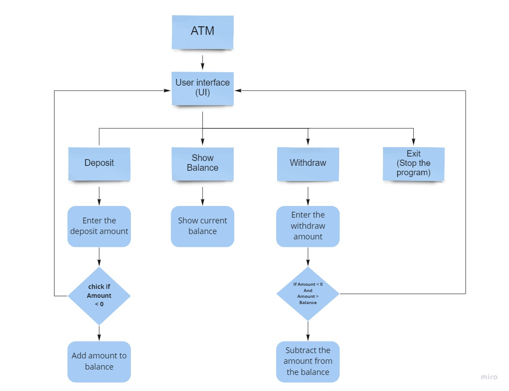

# ATM bank program

## This program simulates ATM machine , This program can help you to do all your transaction and control your account from it this some feature this program support

1. View Balance : Show the current balance amount in your bank account.
2. Withdraw amount : Withdraw the amount you want from your personal account, Depending on the amount in your account.
3. Deposit amount : Also you can easily deposit any amount in your account , And add to your account balance immediately.

## How to use

- Firts information show to you is what is your current balance .

- The program ask you to choose one of this transaction

    1. View your Balance

    2. Withdraw amount

    3. Deposit amount

    4. Exit

- After you choose one of this transaction program ask you to enter the amount you need to (withdraw or Deposit) .

- Note that
    - The amount in Withdraw case must be include balanc amount.
    - The amount in Deposit must be more than zero .

## UI Diagram

- To fully understand what the software looks like and how work, This diagram helps you for that.

## Test Units

- This program is designed and tested for all transactions in full so that the expected values ​​are returned to the user according to the amounts entered through the program , Without any mistake happende